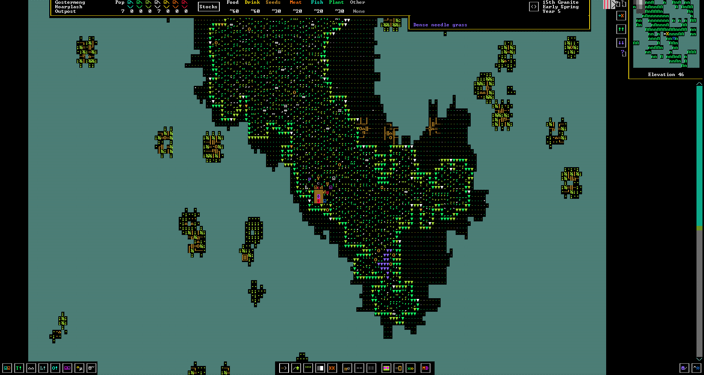
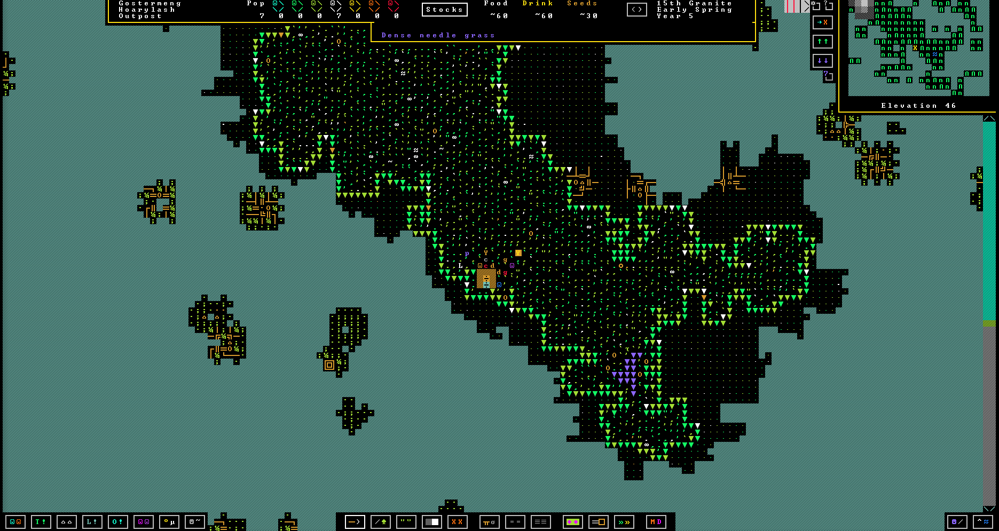
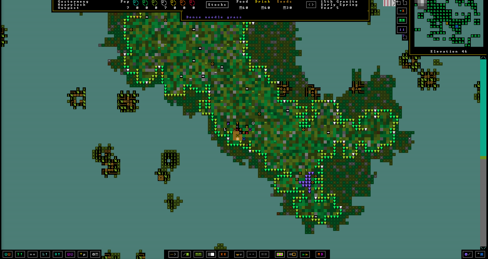
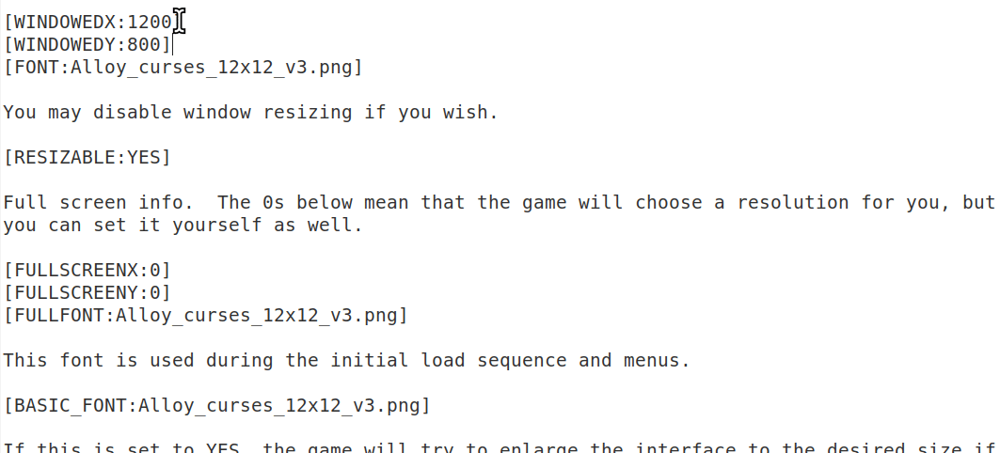

# Инструкция по установке тайлсета на ASCII-версию Dwarf Fortress

В настоящее время, в версии 50.09, возможна установка только обычных, не графических тайлсетов. Примеры графических: Phoebus, Ironhand, Meph. Также, установка тайлсета шириной более 12 пикселей приводит к выходу элементов интерфейса за пределы окна.

## Пример тайлсета 12x12 (Alloy curses)

Стандартный тайлсет

Alloy\_curses\_12x12.png

[mmakart\_curses\_12x12.png](mmakart_curses_12x12.png)

## Что нужно иметь

* Dwarf Fortress версии 50.04 или выше (бесплатная версия, скачать можно на [официальном сайте](http://bay12games.com/dwarves/older_versions.html)).

## Последовательность действий

1. Перейдите в [репозиторий тайлсетов](https://dwarffortresswiki.org/index.php/Tileset_repository).

2. Выберите нужный (тайлсеты "for edited raws" не подойдут).

3. Сохраните его. Нажмите правой кнопкой мыши по картинке, выберите "Сохранить как", откройте папку с игрой, в ней папка data, далее art.

4. Скопируйте название файла картинки (например, `Haberdash_curses_12x12.png`).

5. Откройте в текстовом редакторе (например, блокноте) файл `<папка с игрой>/data/init/init_default.txt`

6. Вставьте название тайлсета, как показано ниже.

7. Сохраните файл.

8. Запустите игру.
